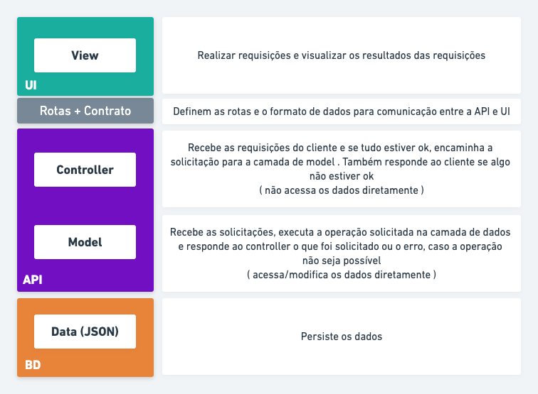
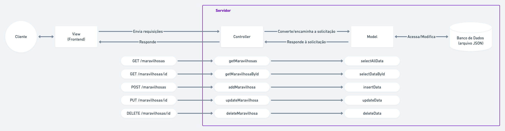
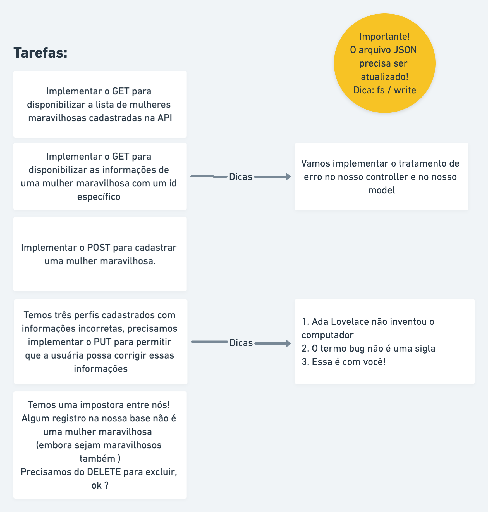

# Projeto 2 - {Reprograma}

Esse projeto foi o desafio da semana 11 do bootcamp do reprograma. 

### Agenda:

- Apresentação professora & monitoras;
- Panorama do projeto;
- Leitura das tarefas;
- Recreio (?)
- Formação das duplas e trabalho em conjunto;
- **Pausa para o almoço**
- 30 minutos para tirar dúvidas gerais do andamento do projeto
- Nova formação de duplas
- Desafio para o lar e preparação para Quarta-Feira

### Arquitetura desejada



*Representação visual/diagrama das camadas do nosso Backend*

### Fluxo do consumo da API



### Estrutura do projeto


```
 📁 api
   |
   |-  📁 src
   |    |  
   |    |- 📁 routes
   |    |- 📁 controller
   |    |- 📁 model
   |    |- 📁 data
   |    |- 📄 app.js
   |
   |- 📄 package.json 
   |- 📄 server.js
```


### Desafios do dia:



